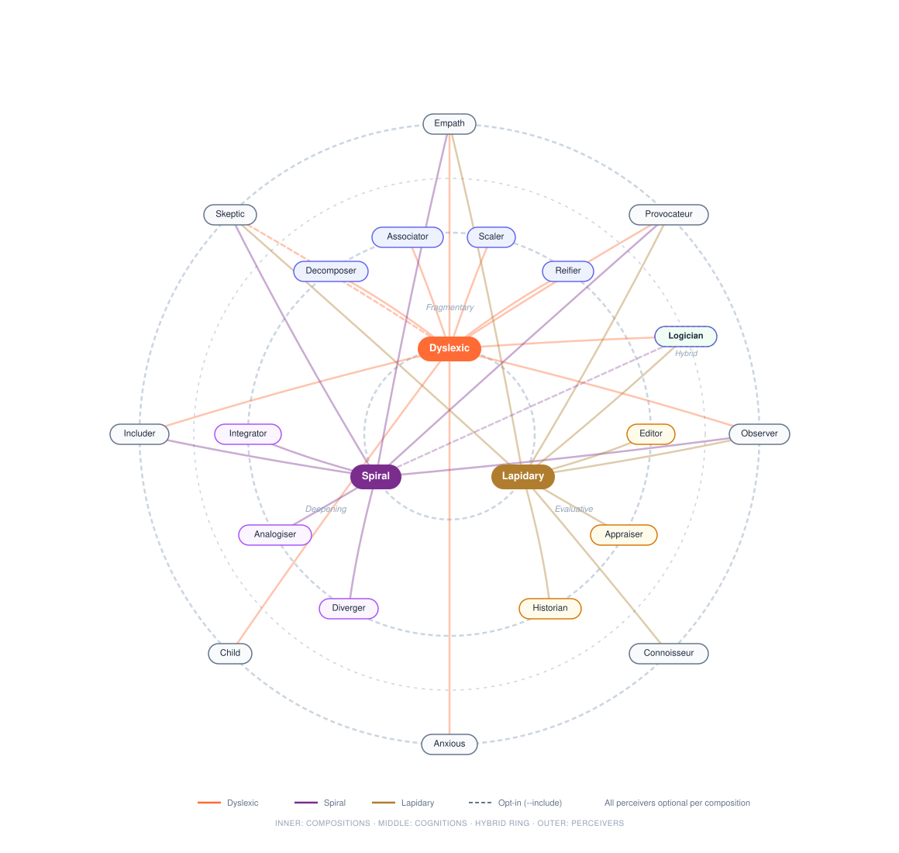
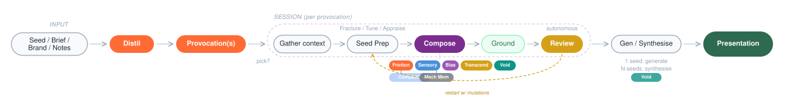
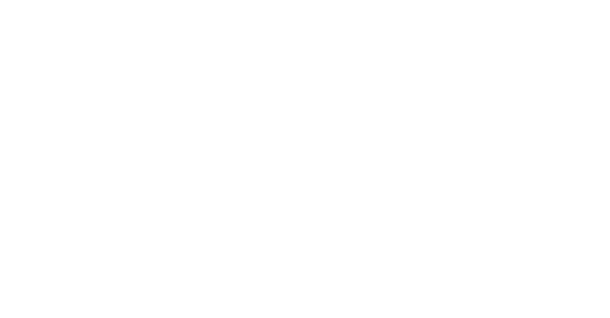
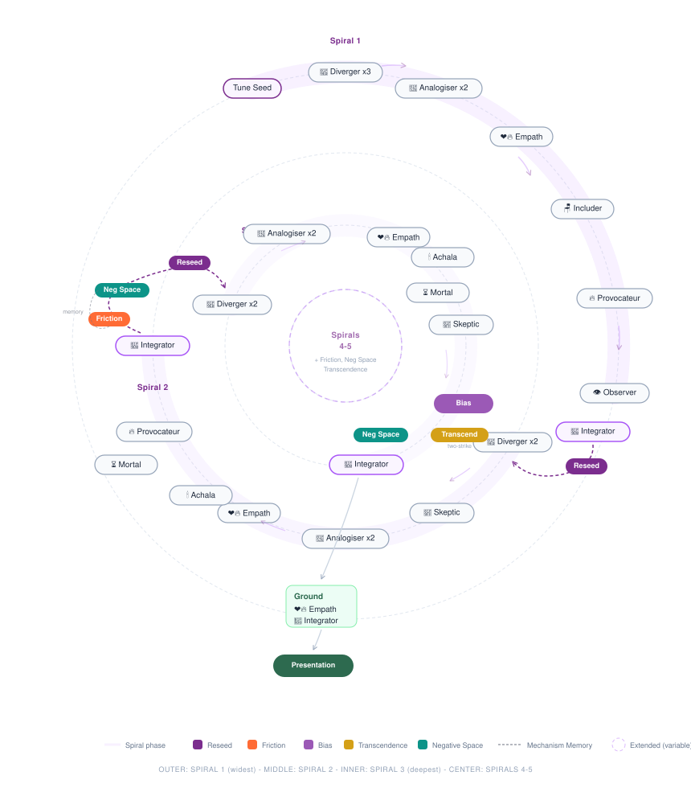
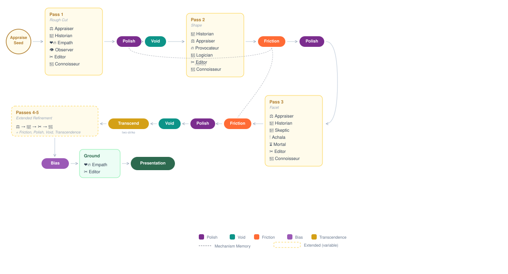

# Think Different Framework (for Claude)

🪟💭🌀☁️🔮🪢💥❤️‍🔥🌊🌱✨💎🪑🏺⚖️📜✂️

Here's to the crazy ones. The misfits. The rebels. The troublemakers. The round pegs in square holes.

Multi-agent structured divergence via Claude Code CLI. Multiple AI agents with different cognitive modes think together, then distil their collisions into a publishable presentation. You plant a seed. They see differently. You harvest the insight.

## Why

AI tools are good at answering questions. But creative breakthroughs come from the collision of ideas that should not be in the same room.

Made By Dyslexia and GCHQ have demonstrated that dyslexic thinking - pattern completion from fragments, involuntary lateral thinking, simultaneous multi-scale processing, comfort with ambiguity - is one of the most valuable cognitive modes for complex problem-solving. GCHQ actively recruits dyslexic thinkers because they spot patterns in data that neurotypical analysts miss.

This framework embodies the "Think Different" philosophy: it does not just use divergent thinking as a technique. It is built from the ground up to see the world through neurodivergent lenses.

No single agent is thinking differently. The system is. The divergent thinking is an emergent property of the architecture.

## Quick Start

### Install via npm

```bash
npm install -g @sinjin/think-different-framework

# Then run from anywhere
think-different "Your seed topic or question"
td "Your seed topic or question"              # short alias
```

### Or clone the repo

```bash
git clone https://github.com/sinjin-studio/think-different-framework.git
cd think-different-framework
chmod +x think.sh

./think.sh "Your seed topic or question"
./think.sh --brief ./client-brief.pdf
```

**Requires:** [Claude Code CLI](https://docs.anthropic.com/en/docs/claude-code) installed and authenticated.

**Works with:** bash 3.2+ (macOS and Linux).

## How It Works

The framework has three levels, like colour theory. **Perceivers** are pigments - how you see. **Cognitions** are operations - what you do with what you see. **Compositions** are palettes - how you sequence perceivers and cognitions together to produce a particular kind of thinking.

Each composition picks from a shared pool of perceivers and pairs them with a set of cognitions, then sequences them across rounds or spirals. The same perceiver (say, The Empath) behaves differently depending on which cognitions surround it and when in the sequence it speaks.



### Perceivers - HOW you see

Shared pool. Every composition draws from these. Each is a productive cognitive bias - a way of seeing that rebels against some default.

| Agent | Bias | What it rebels against |
|-------|------|----------------------|
| ❤️‍🔥 The Empath | Empathy bias | Treating people as abstractions |
| 🔥 The Provocateur | Compression bias | Complexity and politeness |
| 👁️ The Observer | Literal bias | Social filtering and convention |
| 😰 The Anxious | Threat-awareness bias | Optimism bias, unspoken fears |
| 🧒 The Child | Naivety bias | "Grown-up" assumptions |
| 🪑 The Includer | Absence perception | Uninvited constituencies, forgotten people, the empty chair |
| 🧿 The Skeptic | Incongruence detection | What doesn't fit, what's in plain sight but invisible |
| 🏺 The Connoisseur | Quality, proportion & resonance | Indifference to quality, the flattening of taste |

### Cognitions - WHAT you do with what you see

Two sets of cognitive operations. Compositions choose which set to use.

**Fragmentary cognitions** - break, leap, shift, name:

| Agent | Operation |
|-------|-----------|
| 🔍 The Decomposer | Break apart, examine piece as whole |
| 🪢 The Associator | Link across domains, adjacencies |
| 🔭 The Scaler | Change altitude radically |
| 💎 The Reifier | Make invisible visible, name the shape |

**Deepening cognitions** - open, rhyme, integrate:

| Agent | Operation |
|-------|-----------|
| 🧭 The Diverger | Open territory, follow surprise |
| 🔮 The Analogiser | Find structural rhymes across domains |
| 🧐 The Integrator | Find emergent whole, name the unnamed |

**Evaluative cognitions** - weigh, root, pare:

| Agent | Operation |
|-------|-----------|
| ⚖️ The Appraiser | Weigh quality, proportion, fitness |
| 📜 The Historian | Contextualise in tradition, culture, precedent |
| ✂️ The Editor | Refine toward economy, remove everything that is not the thing |

### Compositions - HOW you sequence them

Each composition pairs a cognition set with a selection of perceivers and defines the rhythm - how many rounds, which agents speak when, where friction and bias checks fall.

| Mode | Cognitions | Perceivers | Character | Steps |
|------|------------|------------|-----------|-------|
| 🪟 `dyslexic` | Fragmentary | All except Skeptic | Leaping, collision-driven. 4 rounds of decompose-associate-scale-reify with perceivers woven between. | ~28 |
| 🌀 `spiral` | Deepening | Empath, Provocateur, Observer, Skeptic, Includer | 3 spirals of diverge-analogise-integrate, each reseeding the next. | ~34 |
| 🏺 `lapidary` | Evaluative | Empath, Connoisseur, Provocateur, Observer, Skeptic | Iterative refinement. 3 passes of weigh-root-pare, each more precise than the last. | ~22 |

The Skeptic is excluded from the dyslexic composition by default. Dyslexic thinking naturally produces incongruence detection as a perceptual byproduct - adding an explicit Skeptic agent can over-anchor on what doesn't fit before the leaps have had space to form. Use `--include skeptic` to override this and place it in Round 3.

The Child and Anxious are excluded from the lapidary composition by default. Lapidary thinking requires mature judgement - the discernment of a craftsperson, not wild generation. The Connoisseur takes the evaluative seat that neither Child nor Anxious can occupy.

### Session Flow

Two paths to a presentation. A direct seed runs one session. Raw input (brief, brand, notes) gets distilled into provocations, each provocation runs a full session, then all sessions are synthesised into one presentation.



### 🪟 Dyslexic Composition - step by step

4 rounds. Cognitions and perceivers interleave. Friction between every round. Sensory check mid-session. Bias check before convergence.



### 🌀 Spiral Composition - step by step

3 spirals. Each spiral widens then crystallises. The Integrator's insight reseeds the next spiral. Friction and bias checks in later spirals.



### 🏺 Lapidary Composition - step by step

3 passes. Each pass works the same material with increasing precision. Polish mechanism between passes assesses what survived and what was revealed. Mature judgement only - Child and Anxious excluded by default.



## Usage

### Direct seed (single session)

```bash
./think.sh "How might luxury wellness appeal to Gen Z?"
./think.sh "Your seed topic" --mode spiral --words 1500
./think.sh "Your seed topic" --mode lapidary --words 500
```

### From raw input (distillation mode)

The framework meets you wherever you are. Give it a brief, a brand name, or some notes. It generates provocations, runs each as a separate session, then synthesises into one presentation.

```bash
./think.sh --brief ./client-brief.pdf
./think.sh --brand "Nike"
./think.sh --notes "luxury wellness, Gen Z, sustainability"
./think.sh                                        # auto-detect from project directory
./think.sh --brief ./brief.pdf --pick             # interactive provocation selection
./think.sh --brief ./brief.pdf --mode spiral      # all flags combine
```

### With project context

Run from inside a project directory to automatically ground the thinking in what the project actually is.

```bash
cd ~/projects/my-project && ~/think.sh "seed topic"
./think.sh "seed topic" --context ./brief.md
```

### Presentation operations

```bash
# Re-run presentation at different length
./think.sh --report-only ./think_output/session_*.md --words 2000

# Manual synthesis of existing transcripts
./think.sh --synthesise ./run1/*.md ./run2/*.md --words 1500
```

### Options

| Flag | Description |
|------|-------------|
| `--mode MODE` | Composition: `dyslexic` (default), `spiral`, `lapidary` |
| `--words N` | Target word count for presentation (default: 500-800) |
| `--output DIR` | Output directory (default: ./think_output) |
| `--context FILE` | Explicit context file to ground the session |
| `--brief FILE` | Generate provocations from a brief file |
| `--brand NAME` | Generate provocations from a brand name |
| `--notes TEXT` | Generate provocations from working notes |
| `--pick` | Interactively select which provocations to run |
| `--synthesise` | Synthesise existing transcript files into one presentation |
| `--report-only` | Regenerate presentation from existing transcript |

### Experimentation

The framework is experimental. These flags let you test different configurations without editing mode files.

#### Agent inclusion/exclusion

```bash
./think.sh "seed" --include skeptic          # Force-include Skeptic in dyslexic mode (Round 3)
./think.sh "seed" --exclude anxious,child    # Run without Anxious and Child
./think.sh "seed" --mode spiral --exclude skeptic  # Spiral without Skeptic
```

Agent key names: `empath`, `provocateur`, `observer`, `anxious`, `child`, `skeptic`, `includer`, `connoisseur`, `decomposer`, `associator`, `scaler`, `reifier`, `diverger`, `analogiser`, `integrator`, `appraiser`, `historian`, `editor`.

Explicit `--exclude` wins over `--include`. `--include` overrides mode defaults (e.g. Skeptic excluded from dyslexic by default).

#### Mechanism toggles

```bash
./think.sh "seed" --no-friction    # Skip friction detection between rounds
./think.sh "seed" --no-bias        # Skip cognitive bias checks
./think.sh "seed" --no-sensory     # Skip sensory/context re-injection
```

#### Round/spiral/pass count

```bash
./think.sh "seed" --rounds 2       # Truncated 2-round dyslexic session
./think.sh "seed" --rounds 6       # Extended 6-round session
./think.sh "seed" --mode spiral --spirals 5  # 5-spiral deep session
./think.sh "seed" --mode lapidary --passes 5 # 5-pass deep refinement
```

Fewer rounds/passes truncates from the end (keeps early rounds, always runs Ground). More rounds/passes repeats the middle pattern with fresh instructions.

#### Shuffle

```bash
./think.sh "seed" --shuffle         # Randomize agent order within each round
```

Agents are shuffled within each round/phase, not across rounds. The sequence of rounds remains fixed.

#### Combining flags

```bash
./think.sh "seed" --include skeptic --shuffle --no-sensory
./think.sh "seed" --exclude child --no-friction --rounds 3
```

When experimental flags are active, the session banner shows what's different:

```
  🪟 THINK DIFFERENT FRAMEWORK
  ━━━━━━━━━━━━━━━━━━━━━━━━━━━━━━━━━━━━━━━━━
  Seed: How might luxury wellness...
  Mode: dyslexic
  Presentation: ~500 words
  Experiments:
    + skeptic (included via --include)
    - anxious (excluded via --exclude)
    - friction (disabled via --no-friction)
    ~ shuffle (agent order randomized)
  ━━━━━━━━━━━━━━━━━━━━━━━━━━━━━━━━━━━━━━━━━
```

| Flag | Description |
|------|-------------|
| `--include A,B` | Force-include agents by key name |
| `--exclude A,B` | Force-exclude agents by key name |
| `--no-friction` | Skip friction detection between rounds |
| `--no-bias` | Skip cognitive bias checks |
| `--no-sensory` | Skip sensory/context re-injection |
| `--rounds N` | Number of rounds (dyslexic default: 4) |
| `--spirals N` | Number of spirals (spiral default: 3) |
| `--passes N` | Number of passes (lapidary default: 3) |
| `--shuffle` | Randomize agent order within each round/phase |

## Mechanisms

Beyond agents, the framework uses several between-round mechanisms:

- **Friction detection** - Clark-inspired prediction error detection. Finds where agents contradict each other. The signal is in the mismatch, not the agreement.
- **Sensory check** - Re-injects project context mid-session so abstract thinking collides with ground truth.
- **Cognitive bias detection** - Metacognitive layer that flags anchoring, confirmation bias, groupthink, and other patterns shaping the conversation. Signals, not corrections.
- **Spiral re-seeding** - Extracts the most surprising insight from integration and uses it to seed the next spiral (spiral mode only).
- **Polish** - Between-pass quality assessment. What survived? What was revealed? Is the material getting denser or losing life? (lapidary mode only).

## Output

Each session produces:

- **Presentation** (`presentation_*.pptx`) - A structured presentation with six sections: Provocation, Landscape, Insight, Tension, Experiment, Sources and Threads
- **Transcript** (`session_*.md`) - Full markdown transcript of the thinking session
- **JSON** (`session_*.json`) - Machine-readable transcript for analysis
- **Context** (`context_*.md`) - Project context brief (if gathered)

## Architecture

```
think.sh                          # CLI entry point
lib/
  call_agent.sh                   # Core agent invocation + COMMON_RULES
  json.sh                        # JSON output helpers
  md.sh                          # Markdown output helpers
  markers.sh                     # Round/spiral/phase markers
agents/
  perceivers/                    # Shared human lenses (8 agents)
  cognitions/
    fragmentary/                 # Break, leap, shift, name (4 agents)
    deepening/                   # Open, rhyme, integrate (3 agents)
    evaluative/                  # Weigh, root, pare (3 agents)
context/
  gather.sh                      # Project context gathering
  provoke.sh                     # Provocation generation from raw input
  fracture.sh                    # Seed fracturing (dyslexic)
  tune.sh                        # Seed tuning (spiral)
  appraise.sh                    # Seed appraisal (lapidary)
mechanisms/
  friction.sh                    # Between-round friction detection
  sensory.sh                     # Project context re-injection
  bias.sh                        # Cognitive bias detection
  reseed.sh                      # Spiral re-seeding
  polish.sh                      # Between-pass quality assessment (lapidary)
modes/
  dyslexic.sh                    # Fragmentary composition
  spiral.sh                      # Deepening composition
  lapidary.sh                    # Evaluative composition (iterative refinement)
report/
  generate.sh                    # Single transcript to presentation
  synthesise.sh                  # Multiple transcripts to one presentation
```

## Credits

Inspired by the cognitive science of dyslexic thinking (Made By Dyslexia, GCHQ), predictive processing (Andy Clark), behavioural science (Rory Sutherland), and the philosophy that the people who are crazy enough to think they can change the world are the ones who do.
