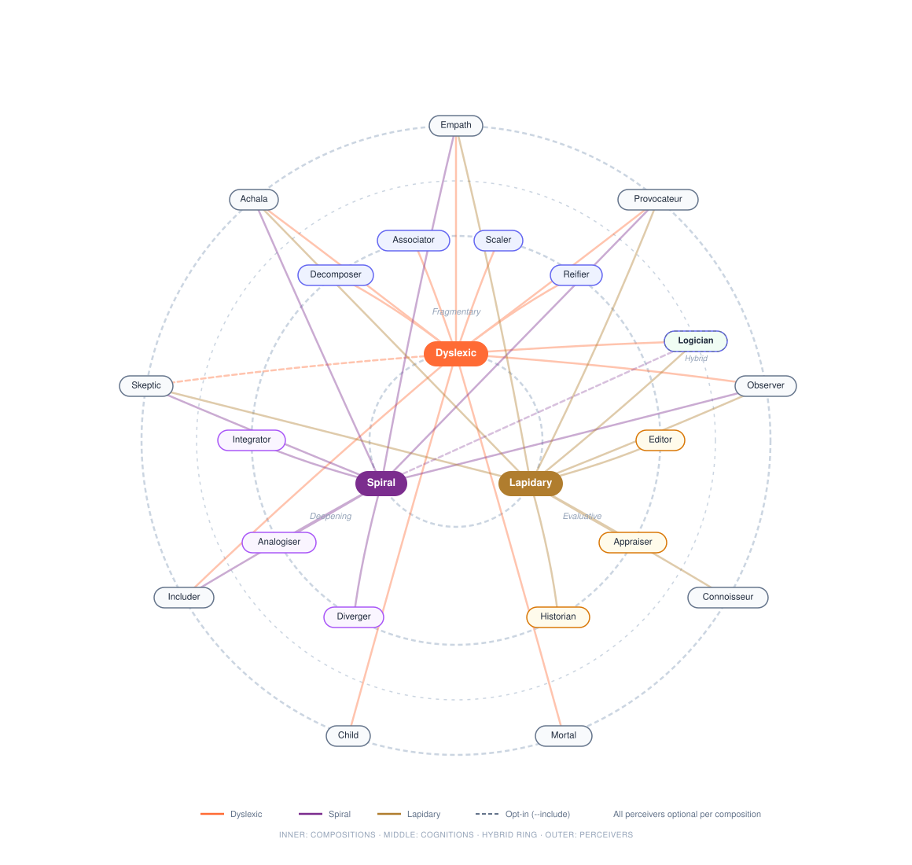

# Think Different Framework (for Claude)

Here's to the crazy ones. The misfits. The rebels. The troublemakers. The round pegs in square holes.

Multi-lens structured divergence via Claude Code CLI. Multiple cognitive lenses think together, then distil their collisions into a publishable presentation. You plant a seed. They see differently. You harvest the insight.

**Autonomous mode is on by default.** A conductor orchestrates lenses with autonomous decision-making, lenses skip turns when they have nothing new to add, mechanisms return structured decisions that shape session flow, and a reviewer can restart sessions with mutations when output stays conventional. Use `--no-autonomous` to fall back to hardcoded composition sequences.

## Why

AI tools are good at answering questions. But creative breakthroughs come from the collision of ideas that should not be in the same room.

Made By Dyslexia and GCHQ have demonstrated that dyslexic thinking - pattern completion from fragments, involuntary lateral thinking, simultaneous multi-scale processing, comfort with ambiguity - is one of the most valuable cognitive modes for complex problem-solving. GCHQ actively recruits dyslexic thinkers because they spot patterns in data that neurotypical analysts miss.

This framework embodies the "Think Different" philosophy: it does not just use divergent thinking as a technique. It is built from the ground up to see the world through neurodivergent lenses.

No single lens is thinking differently. The system is. The divergent thinking is an emergent property of the architecture.


## Quick Start

### Install via npm

```bash
npm install -g @sinjin/think-different-framework

# Then run from anywhere
think-different "Your seed topic or question"
td "Your seed topic or question"              # short alias
```

### Or clone the repo

```bash
git clone https://github.com/sinjin-studio/think-different-framework.git
cd think-different-framework
chmod +x think.sh

./think.sh "Your seed topic or question"
./think.sh --brief ./client-brief.pdf
```

**Requires:** [Claude Code CLI](https://docs.anthropic.com/en/docs/claude-code) installed and authenticated.

**Works with:** bash 3.2+ (macOS and Linux).

> [!WARNING]
> **This will eat your tokens.** Every session fires 19+ lenses, each reading the full conversation history. In autonomous mode, the conductor, reviewer, and tools add further calls. A single run can burn through a good chunk of your session budget. It is a deliberate, token-heavy collision engine. The framework auto-detects your Claude plan (Pro=1 seed, Max/Team/Enterprise=3 seeds). Override with `--seeds N`. See [Plan Recommendations](#plan-recommendations) for details.

## How It Works

The framework has three levels, like colour theory. **Perceivers** are pigments - how you see. **Cognitions** are operations - what you do with what you see. **Compositions** are palettes - how you sequence perceivers and cognitions together to produce a particular kind of thinking.

Each composition picks from a shared pool of perceivers and pairs them with a set of cognitions, then sequences them across rounds or spirals. The same perceiver (say, The Empath) behaves differently depending on which cognitions surround it and when in the sequence it speaks.



### Perceivers - HOW you see

Shared pool. Every composition draws from these. Each is a productive cognitive bias - a way of seeing that rebels against some default.

| Lens | Bias | What it rebels against |
|-------|------|----------------------|
| 💞🪷 The Empath | Empathy bias | Treating people as abstractions |
| 💣🌶️ The Provocateur | Compression bias | Complexity and politeness |
| 👁️🔍 The Observer | Literal bias | Social filtering and convention |
| ⏳💀 The Mortal | Finitude, impermanence & urgency | The illusion of infinite time, deferral as strategy |
| 🧒❓ The Child | Naivety bias | "Grown-up" assumptions |
| 🪑👤 The Includer | Absence perception | Uninvited constituencies, forgotten people, the empty chair |
| 🧿🪞 The Skeptic | Incongruence detection | What doesn't fit, what's in plain sight but invisible |
| 🏺⚖️ The Connoisseur | Quality, proportion & resonance | Indifference to quality, the flattening of taste |
| ⚔️❤️‍🔥 The Achala | Devotion, interconnection & the sacred | Transactionalism, reducing every motivation to incentive |

### Cognitions - WHAT you do with what you see

Compositions choose which cognition set to use. The Logician is a hybrid - it fuses structural perception with causal reasoning and participates in both dyslexic and lapidary compositions.

| Set | Lenses | Operations |
|-----|--------|------------|
| **Fragmentary** | 🔍🫧 Decomposer, 🪢🌉 Associator, 🔭🔬 Scaler, 💎👁️‍🗨️ Reifier | Break, leap, shift, name |
| **Deepening** | 🧭🌀 Diverger, 🔮🧬 Analogiser, 🧐🕸️ Integrator | Open, rhyme, integrate |
| **Evaluative** | ⚖️🎚️ Appraiser, 📜🏛️ Historian, ✂️🪶 Editor | Weigh, root, pare |

### Compositions - HOW you sequence them

Each composition pairs a cognition set with a selection of perceivers and defines the rhythm - how many rounds, which lenses speak when, where friction and bias checks fall.

| Mode | Cognitions | Perceivers | Character |
|------|------------|------------|-----------|
| 💫🔀 `dyslexic` | Fragmentary + Logician | All except Skeptic | Leaping, collision-driven. Rounds of decompose-associate-scale-reify with perceivers woven between |
| 🌀🌿 `spiral` | Deepening | Empath, Provocateur, Observer, Skeptic, Includer, Achala | Spirals of diverge-analogise-integrate, each reseeding the next |
| 🪨✨ `lapidary` | Evaluative + Logician | Empath, Connoisseur, Provocateur, Observer, Skeptic, Achala | Iterative refinement. Passes of weigh-root-pare, each more precise than the last |

## Usage

### Direct seed (single session)

```bash
./think.sh "How might luxury wellness appeal to Gen Z?"
./think.sh "Your seed topic" --mode spiral --words 1500
./think.sh "Your seed topic" --mode lapidary --words 500
```

### From raw input (distillation phase)

The framework meets you wherever you are. Give it a brief, a brand name, or some notes. It generates provocations, runs each as a separate session, then synthesises into one presentation.

```bash
./think.sh --brief ./client-brief.pdf
./think.sh --brand "Nike"
./think.sh --notes "luxury wellness, Gen Z, sustainability"
./think.sh                                        # auto-detect from project directory
./think.sh --brief ./brief.pdf --pick             # interactive provocation selection
./think.sh --brand "Nike" --audience "runners who need permission to start"
./think.sh --brief ./brief.pdf --mode spiral      # all flags combine
```

### With project context

Run from inside a project directory to automatically ground the thinking in what the project actually is.

```bash
cd ~/projects/my-project && ~/think.sh "seed topic"
./think.sh "seed topic" --context ./brief.md
```

### Presentation operations

```bash
# Re-run presentation at different length
./think.sh --report-only ./think-different-output/my-session/session.md --words 2000

# Manual synthesis of existing transcripts
./think.sh --synthesise ./run1/*.md ./run2/*.md --words 1500
```

Control provocation character with `--tone` (default: `provocative`). See [Tones](#tones). Control perceiver depth with `--depth` (default: `deep`). See [Depth](#depth).

## Options

| Flag | Description |
|------|-------------|
| **Core** | |
| `--mode MODE` | Composition: `dyslexic` (default), `spiral`, `lapidary` |
| `--words N` | Target word count for presentation (default: 1500) |
| `--output DIR` | Output directory (default: ./think-different-output) |
| `--context FILE` | Explicit context file to ground the session |
| **Input** | |
| `--brief FILE` | Generate provocations from a brief file |
| `--brand NAME` | Generate provocations from a brand name |
| `--notes TEXT` | Generate provocations from working notes |
| `--audience TEXT` | Target audience (auto-inferred from input if not set) |
| `--tone TONE` / `-t` | Provocation tone (default: `provocative`). See [Tones](#tones) |
| `--seeds N` | Number of provocations to generate (auto-detected from plan, max: 12) |
| `--pick` | Interactively select which provocations to run |
| **Output** | |
| `--type TYPES` | Output types: `insight`, `brief`, `manifesto` (default: all three, comma-separated) |
| `--lines N` | Number of rallying lines to generate (default: 3, max: 7) |
| `--practitioners LIST` | Comma-separated creative practitioners as quality bar for The Line |
| `--html` | Enable HTML presentation generation (experimental, off by default) |
| `--formats LIST` | Output formats for `--report-only`: `all`, `md`, `doc`, `html` (comma-separated) |
| `--report-only FILE` | Regenerate presentation from existing transcript |
| `--synthesise` | Synthesise existing transcript files into one presentation |
| `--resume FILE` | Resume an interrupted session from state file |
| **Tuning** | |
| `--depth LEVEL` | Lens depth: `deep` (default), `deeper`, `deepest`. Per-lens: `mortal:deepest,achala:deeper`. See [Depth](#depth) |
| `--rounds N` | Number of rounds (dyslexic default: 7) |
| `--spirals N` | Number of spirals (spiral default: 5) |
| `--passes N` | Number of passes (lapidary default: 5) |
| `--turns N` | Max turns for autonomous conductor (default: 35) |
| `--min-turns N` | Min turns before conductor can end session (default: 15) |
| `--shuffle` | Randomize lens order within each round/phase |
| `--include A,B` | Force-include lenses by key name |
| `--exclude A,B` | Force-exclude lenses by key name |
| **Mechanisms** | |
| `--no-friction` | Skip friction detection between rounds |
| `--no-bias` | Skip cognitive bias checks |
| `--no-sensory` | Skip sensory/context re-injection |
| `--no-negative-space` | Skip negative space mapping |
| `--no-transcendence` | Skip transcendence check |
| `--no-ground` | Skip assumption grounding embedded in seed prep |
| `--ground-only` | Run only the grounding step, then exit |
| **Mode** | |
| `--autonomous` | Enable agentic mode (default: on) |
| `--no-autonomous` | Disable agentic mode, use hardcoded composition sequences (also disables auto-wait) |
| `--no-wait` | Disable auto-wait on cap hit (default: polls for reset in autonomous mode, for overnight runs) |
| `--skip-strict` | Use separate pre-call for skip-turn instead of inline detection |
| `--compact` | Enable context compaction (off by default, opt in for very long sessions) |
| `--allowedTools TOOLS` | Tools for Claude CLI (default: `"WebSearch,WebFetch"`, use `""` to disable) |

## Output

Each session produces:

- **Presentation** (`presentation.md` / `.docx` / `.html`) - The Line (winning platform + expression), the experiment, the asset (sensory/tactile creative description), creative brief, manifesto, insight article, and session findings (novel ideas for inspiration). Controlled by `--type`. The presentation pipeline distils session findings first, then all sections are anchored on the deepest material. HTML version features cinematic scroll effects with GSAP ScrollTrigger
- **Transcript** (`session_*.md`) - Full markdown transcript of the thinking session
- **JSON** (`session_*.json`) - Machine-readable transcript for analysis
- **Context** (`context_*.md`) - Project context brief (if gathered)

---

## Advanced

Everything below is for tuning, experimenting, and understanding the internals. You don't need any of this to run your first session.

### Plan Recommendations

- **Pro plan** - Framework defaults to 1 provocation. Enough for single-seed exploration. Multi-provocation sessions will likely hit rate limits.
- **Max plan** (recommended) - Defaults to 3 provocations. Best for brief/brand/notes input where multiple angles matter.
- **Enterprise/Team** - Defaults to 3 provocations. Higher rate limits for intensive use.

The framework detects your Claude plan automatically via `claude auth status` and sets the default seed count. Override with `--seeds N`. Use `--pick` to generate provocations then select which to run.

**Auto-wait on cap hit:** In autonomous mode (default), the framework automatically polls for cap reset when credits are exhausted - start at 5-minute intervals, increasing to 10 minutes, for up to 4 hours. This enables unattended overnight runs. Disable with `--no-wait`.

### Tones

The `--tone` flag controls the character of provocation generation. Each tone shapes how the framework turns your input into a seed worth thinking about.

| Tone | Description |
|------|-------------|
| 💣🌶️ `provocative` (default) | Uncomfortable, not safe. Forces a position. Pushes beyond input material |
| 🌷🎁 `generous` | Radically positive, finds hidden strength, reveals untapped potential |
| 🤲🫀 `personal` | Zoomed to one human, one moment, sensory detail. Turns market into person |
| 🦞📞 `absurd` | Surreal, lateral, alien. Breaks fundamental assumptions |
| ☁️💭 `daydream` | Loose, wandering, permission-giving. Drifts past edges |
| 🎲✨ `mixed` | All five tones, assigned round-robin across seeds |

Comma-separate tones to assign them round-robin across seeds. With `--tone provocative,generous,personal` and 6 seeds, seed 1 gets provocative, seed 2 generous, seed 3 personal, seed 4 provocative again, and so on.

```bash
./think.sh --brand "Nike" --tone generous
./think.sh --brief ./brief.pdf --tone provocative,personal,absurd
./think.sh --brand "Patagonia" --tone mixed --seeds 5
```

### Depth

The `--depth` flag controls how deep into fundamental human drivers the perceiver lenses go. Each level contains the previous - deeper prompts layer on top, they don't replace. Affects five lenses: Mortal, Achala, Empath, Child, Provocateur.

| Level | Description |
|-------|-------------|
| `deep` (default) | Current lens behaviour - already meaningful depth |
| `deeper` | The drivers behind the drivers - legacy, fierce compassion, desire beneath desire, pre-assumption, uncomfortable truth |
| `deepest` | Full humanity, nothing hidden - mortality salience, immovable determination, the wound beneath the desire, beginner's mind as epistemology, identity-threatening truth |

```bash
# All depth-aware lenses at deepest
./think.sh "seed" --depth deepest

# Per-lens control
./think.sh "seed" --depth mortal:deepest,achala:deeper

# Global deeper, mortal override to deepest
./think.sh "seed" --depth deeper,mortal:deepest
```

### Experimentation

The framework is experimental. These flags let you test different configurations without editing mode files.

#### Lens inclusion/exclusion

```bash
./think.sh "seed" --include skeptic          # Force-include Skeptic in dyslexic mode (Round 3)
./think.sh "seed" --exclude mortal,child    # Run without Mortal and Child
./think.sh "seed" --mode spiral --exclude skeptic  # Spiral without Skeptic
```

Lens key names: `empath`, `provocateur`, `observer`, `mortal`, `child`, `skeptic`, `includer`, `connoisseur`, `achala`, `decomposer`, `associator`, `scaler`, `reifier`, `diverger`, `analogiser`, `integrator`, `appraiser`, `historian`, `editor`, `logician`.

Explicit `--exclude` wins over `--include`. `--include` overrides mode defaults (e.g. Skeptic excluded from dyslexic by default).

#### Mechanism toggles

```bash
./think.sh "seed" --no-friction    # Skip friction detection between rounds
./think.sh "seed" --no-bias        # Skip cognitive bias checks
./think.sh "seed" --no-sensory     # Skip sensory/context re-injection
./think.sh "seed" --no-transcendence  # Skip transcendence check
./think.sh "seed" --no-negative-space        # Skip negative space mapping
```

#### Round/spiral/pass count

```bash
./think.sh "seed" --rounds 2       # Truncated 2-round dyslexic session
./think.sh "seed" --rounds 6       # Extended 6-round session
./think.sh "seed" --mode spiral --spirals 5  # 5-spiral deep session
./think.sh "seed" --mode lapidary --passes 5 # 5-pass deep refinement
```

Fewer rounds/passes truncates from the end (keeps early rounds). More rounds/passes repeats the middle pattern with fresh instructions.

#### Shuffle

```bash
./think.sh "seed" --shuffle         # Randomize lens order within each round
```

Lenses are shuffled within each round/phase, not across rounds. The sequence of rounds remains fixed.

#### Combining flags

```bash
./think.sh "seed" --include skeptic --shuffle --no-sensory
./think.sh "seed" --exclude child --no-friction --rounds 3
```

When experimental flags are active, the session banner shows what's different:

```
  🪟 THINK DIFFERENT FRAMEWORK
  ━━━━━━━━━━━━━━━━━━━━━━━━━━━━━━━━━━━━━━━━━
  Seed: How might luxury wellness...
  Mode: dyslexic
  Audience: Gen Z consumers seeking wellness that...
  Presentation: ~500 words
  Experiments:
    + skeptic (included via --include)
    - mortal (excluded via --exclude)
    - friction (disabled via --no-friction)
    ~ shuffle (lens order randomized)
  ━━━━━━━━━━━━━━━━━━━━━━━━━━━━━━━━━━━━━━━━━
```

### Autonomous Mode (default)

Genuinely agentic behaviour, on by default:

- **Conductor** - Replaces hardcoded composition sequences. An agent that decides which lens speaks next, what instruction to give, and when to trigger mechanisms or end the session. Three conductor presets (dyslexic/spiral/lapidary) shape its orchestration style.
- **Inline skip-turn** - Each lens decides within its response whether it has something genuinely new to add. If not, it responds with `SKIP: reason` and the turn is logged without wasting a separate pre-call. Use `--skip-strict` to restore the original two-call pattern if inline detection proves unreliable.
- **Context compaction (opt-in)** - Disabled by default. When enabled via `--compact`, every 8-10 turns the conversation is distilled into a digest plus the last 3-4 verbatim turns. Off by default because breakthroughs often arrive at iteration 10+ and compaction destroys the raw phrasing that fuels them. Opus 4.6's 1M context window handles full conversations comfortably. Full transcript is always preserved in output files.
- **Structured mechanism decisions** - Friction returns `{recommendation: "deepen|redirect|continue"}` and can inject a specific lens. Transcendence returns `{has_breakthrough: bool}` and can skip to grounding. Negative space returns `{recommendation: "redirect_to_void|note_and_continue|void_is_intentional"}` and identifies unexplored territories with suggested lenses. Mechanisms receive a structured history of prior mechanism findings, so each builds on the last.
- **Provocation review** - When multiple provocations are generated, they're reviewed for distinctness before sessions begin. Similar provocations get merged, weak ones get reframed.
- **Adversarial session reviewer** - Post-composition quality gate using a prosecution/defense/verdict pattern. The prosecution assumes the session failed and searches for prior art (WebSearch). The defense concedes weak ideas and argues only for genuine divergence. The verdict decides restart/proceed from the adversarial exchange. Can restart with mutations: different mode, shuffled lens order, reframed seed. 2-run ceiling per provocation. Synthesises across both runs.

```bash
# Autonomous is the default - just run:
./think.sh "seed"
./think.sh --brief ./brief.pdf --mode spiral

# Opt out to use hardcoded sequences:
./think.sh "seed" --no-autonomous
```

### Mechanisms

Beyond lenses, the framework uses metacognitive mechanisms that operate *outside* the conversation to shape session flow. Each receives structured history of prior mechanism findings, so they build on each other rather than re-discovering the same patterns.

| Mechanism | Emoji | When | What it does | Structured output |
|-----------|-------|------|--------------|-------------------|
| Assumption Grounding | 🌍🔬 | Seed prep | Surfaces assumptions most likely to be wrong, verifies via web search | Verified/unverified assumptions |
| Friction | 🔥⚡ | Between rounds | Finds where lenses contradict each other - signal is in the mismatch | `{recommendation, inject_lens}` |
| Sensory | 🎨👃 | Mid-session | Re-injects project context so abstract thinking collides with ground truth | Context collision |
| Bias | 🧠🪤 | Before convergence | Identifies cognitive biases as creative fuel - craft, not manipulation | `{biases_detected, recommendation}` |
| Transcendence | ✨🚀 | Late session (2-strike) | Checks if session has reached beyond starting assumptions | `{has_breakthrough, recommendation}` |
| Negative Space | 🔭🌑 | Mid-late session | Maps unexplored territory - the dark patches between the lit areas | `{territories, pattern_of_avoidance, recommendation}` |
| Reseed | 🌱🔄 | Between spirals | Extracts most surprising insight to seed next spiral | Reframed seed |
| Polish | 💎🔍 | Between passes | Assesses what survived and what was revealed | Quality assessment |
| Review | ⚖️🔎 | Post-session | Adversarial prosecution/defense/verdict quality gate | Restart or proceed |

- **Assumption grounding** is embedded in seed preparation (fracture/tune/appraise). Surfaces assumptions most likely to be wrong and verifies factual claims via web search. No interactive correction needed - the framework does its own homework.
- **Friction detection** is Clark-inspired prediction error detection. Finds where lenses contradict each other. The signal is in the mismatch, not the agreement.
- **Sensory check** re-injects project context mid-session so abstract thinking collides with ground truth.
- **Cognitive bias as creative fuel** identifies which cognitive biases are alive in the conversation and asks how each could be channelled into something authentic. Loss aversion becomes urgency, identity bias becomes belonging, scarcity becomes desire. Craft, not manipulation.
- **Transcendence** uses a two-strike pattern: first positive signal is noted but the session continues, second consecutive signal triggers early grounding. This prevents premature exit - research shows breakthroughs often arrive at iteration 10+.
- **Negative space** is mid-session cartography of absence. Maps what the conversation has NOT explored relative to the provocation - scales, audiences, emotions, time horizons, domains that no lens has entered. Like the Hubble Deep Field: points at the dark patches precisely because the absence of foreground noise is the condition for seeing further. Can redirect a lens into the dark patches. In synthesis, maps the collective blind spot across multiple runs.
- **Mechanism memory** ensures each mechanism receives a structured history of what previous mechanisms discovered, so friction at round 3 knows what friction at round 1 flagged and focuses on what's new or evolved. Prevents the same tensions being re-discovered without progress.
- **Spiral re-seeding** extracts the most surprising insight from integration and uses it to seed the next spiral (spiral mode only).
- **Polish** is between-pass quality assessment. What survived? What was revealed? Is the material getting denser or losing life? (lapidary mode only).

### Assumption Grounding

Grounding is embedded directly in seed preparation (fracture, tune, or appraise). Before breaking apart or assessing the seed, the model surfaces 3-4 assumptions about the problem, audience, or situation most likely to be wrong, with alternative realities for each.

Web search is enabled by default (`WebSearch,WebFetch`). When available, the model verifies factual claims - market data, demographics, trends - and marks each assumption as VERIFIED or UNVERIFIED. This means the framework does its own homework rather than blocking the session for interactive user correction.

When web search is unavailable (via `--allowedTools ""`), assumptions are marked UNVERIFIED and held loosely by agents. A warning is printed with instructions to re-enable.

This matters because assumptions form during seed preparation, BEFORE any of the existing checking mechanisms fire (friction, bias, sensory, Observer, Skeptic all run DURING composition rounds). Without grounding, contaminated assumptions bake into the conversation that every lens builds on.

```bash
./think.sh "your seed topic" --ground-only
./think.sh "your seed topic" --context ./brief.md --ground-only
```

### Session Flow

Two paths to a presentation. A direct seed runs one session. Raw input (brief, brand, notes) gets distilled into provocations, each provocation runs a full session, then all sessions are synthesised into one presentation.

##### 

### Composition Flows

#### 💫🔀 Dyslexic Composition - step by step

7 rounds (default). Cognitions and perceivers interleave. Friction between every round. Sensory check mid-session. Bias check before convergence. Negative space and transcendence checks from round 5 onwards (two-strike pattern - first signal noted, second triggers grounding).


#### 🌀🌿 Spiral Composition - step by step

5 spirals (default). Each spiral widens then crystallises. The Integrator's insight reseeds the next spiral. Friction, bias, negative space and transcendence checks from spiral 3 onwards.


#### 🪨✨ Lapidary Composition - step by step

5 passes (default). Each pass works the same material with increasing precision. Polish mechanism between passes assesses what survived and what was revealed. Negative space and transcendence checks from pass 3 onwards. Mature judgement only - Child excluded by default.


### Lens Exclusion Defaults

The Skeptic is excluded from the dyslexic composition by default. Dyslexic thinking naturally produces incongruence detection as a perceptual byproduct - adding an explicit Skeptic lens can over-anchor on what doesn't fit before the leaps have had space to form. Use `--include skeptic` to override this and place it in Round 3.

The Child is excluded from the lapidary composition by default. Lapidary thinking requires mature judgement - the discernment of a craftsperson, not wild generation. The Connoisseur takes the evaluative seat that the Child cannot occupy.

### Architecture

```
think.sh                          # CLI entry point
lib/
  call_lens.sh                   # Core lens invocation + COMMON_RULES + compaction (opt-in) + mechanism memory + flow control
  conductor_loop.sh              # Agentic orchestration loop (--autonomous)
  cap_check.sh                   # Cap detection + claude_call / claude_call_json wrappers
  json.sh                        # JSON output helpers
  md.sh                          # Markdown output helpers
  markers.sh                     # Round/spiral/phase markers
lenses/
  conductor.sh                   # The Conductor - first true agent, orchestrates lenses
  perceivers/                    # Shared perceiver lenses (9 lenses)
  cognitions/
    fragmentary/                 # Break, leap, shift, name (4 lenses)
    deepening/                   # Open, rhyme, integrate (3 lenses)
    evaluative/                  # Weigh, root, pare (3 lenses)
  hybrids/                       # Lenses that break the perceiver/cognition boundary
    logician.sh                  # Fused structural perception + causal reasoning
context/
  gather.sh                      # Project context gathering
  ground.sh                      # Standalone grounding (--ground-only) + shared preamble
  provoke.sh                     # Provocation generation + review gate (--autonomous)
  fracture.sh                    # Seed fracturing (dyslexic)
  tune.sh                        # Seed tuning (spiral)
  appraise.sh                    # Seed appraisal (lapidary)
mechanisms/
  friction.sh                    # Between-round friction detection (structured decisions)
  sensory.sh                     # Project context re-injection
  bias.sh                        # Cognitive bias detection (structured decisions)
  transcendence.sh               # Transcendence check (structured decisions)
  review.sh                      # Adversarial session reviewer - prosecution/defense/verdict
  negative_space.sh              # Negative space mapping (mid-session + synthesis)
  reseed.sh                      # Spiral re-seeding
  polish.sh                      # Between-pass quality assessment (lapidary)
modes/
  dyslexic.sh                    # Fragmentary composition (conductor preset in --autonomous)
  spiral.sh                      # Deepening composition (conductor preset in --autonomous)
  lapidary.sh                    # Evaluative composition (conductor preset in --autonomous)
report/
  generate.sh                    # Single transcript to presentation
  synthesise.sh                  # Multiple transcripts to one presentation
```

### The Ralph Wiggam Loop

Every lens call is a stateless `claude -p` invocation - a fresh context window with no memory of prior reasoning. The conversation output accumulates as input (each lens reads "the minutes of the meeting so far"), but the internal chain-of-thought from every previous call is discarded completely. Lens 20 reasons as freshly as lens 1. No attention degradation, no compounding drift across a 30+ turn session.

Context compaction is available via `--compact` for very long sessions but is off by default. [Anthropic's harness design research](https://www.anthropic.com/engineering/harness-design-long-running-apps) shows creative breakthroughs arriving at iteration 10+, and compaction risks destroying the raw phrasing that fuels them. With Opus 4.6's 1M context window, full conversations are handled comfortably without compression.

This architecture is [Geoffrey Huntley's Ralph Wiggam loop](https://ghuntley.com/specs/ralph/) - a pattern he originated for agentic AI systems where the model is called in a loop, with the context window clearing between iterations to prevent accumulated reasoning from degrading output quality.

This framework applies the Ralph Wiggam loop to a different problem. Where the pattern is typically used for task automation - retrying, refining, converging on a correct answer - here it drives creative divergence. Each lens gets a clean reasoning slate specifically so it can see differently. The accumulated conversation is raw material, not instructions. The fresh window is not a workaround for context limits - it is the mechanism that keeps 20 lenses from collapsing into one voice.

## Credits

Inspired by the cognitive science of dyslexic thinking (Made By Dyslexia, GCHQ), the Ralph Wiggam loop architecture (Geoffrey Huntley), predictive processing ('The Experience Machine' Andy Clark), behavioural science (Rory Sutherland), and the philosophy that the people who are crazy enough to think they can change the world are the ones who do (Apple).
